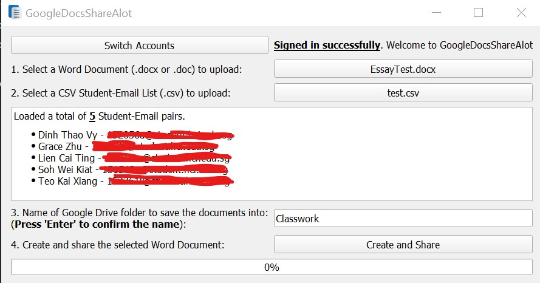

# googleDocsShareAlot
googleDocsShareAlot is a simple GUI program written in Python using the pyqt5 GUI library. It's main purpose is to allow users to choose a word document (.doc or .docx) and share it **individually** with a large number of users given in a .csv list, with each Google Document renamed after the person in the list. 

We originally wrote this program to help a teacher send out homework Google Docs that are shared privately with each individual and with each Google Doc renamed after the student, so that there is no need to create and share each Google Doc individually for each student.




## Using The Exe In The [Dist Folder](https://github.com/Tkaixiang/googleDocsShareAlot/tree/master/dist)

We have compiled an exe using Pyinstaller for easy use, but you will still need to obtain your own `client_secrets.json` first. 

1. Download the exe (`GoogleDocsShareAlot.exe`) from the `/dist` folder
2. Follow this [tutorial here](https://pythonhosted.org/PyDrive/quickstart.html) to obtain a `client_secrets.json`
3. Place the `client_secrets.json` in the **same folder as the exe**
4. Run and profit!

<u>Note:</u> The `.csv Student-Email list` should have the 1st column containing the names of each student and the 2nd column containing the respective emails of each student

## Running Using Python

- main.py is the GUI script
- API.py is the API script

<u>Note:</u> Need to use an older version (`1.8.0`) of `google-api-python-client` as newer versions don't seem to work with pyinstaller. Requirements.txt has the correct version. https://github.com/googleapis/google-api-python-client/issues/876

```bash
pip install -r requirements.txt
py main.py
```

If you want to build the exe, run the following command:

```bash
pyinstaller GoogleDocsCreator.spec
```

The exe should appear in the `/dist` folder